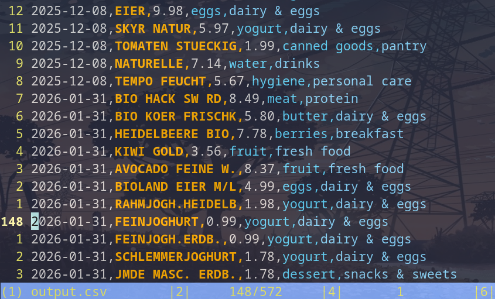
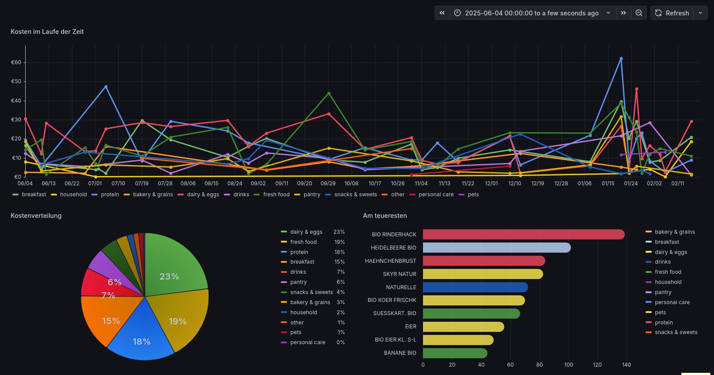
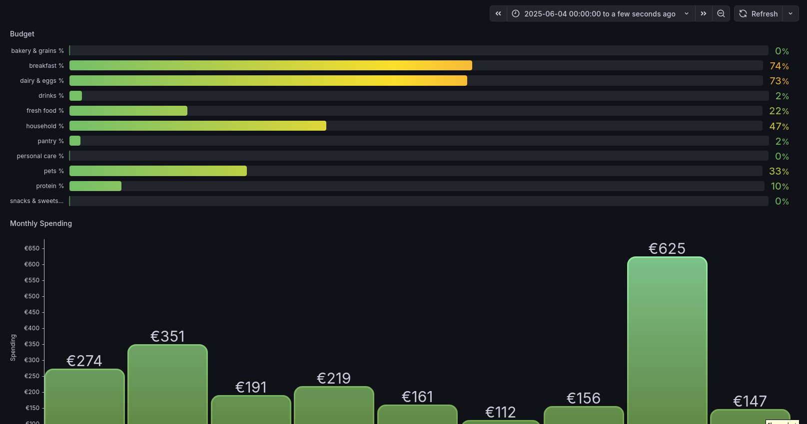

# Rewe Einkauf Auswerter

Convert REWE eBon PDF receipts into a categorized CSV for further analysis (Excel, Pandas, Grafana, etc.).

## What it does
- Reads REWE eBon **PDFs**
- Extracts items + prices
- Groups items into categories
- Writes a single `output.csv`

## Requirements
- Python 3.*
- `pypdf`

## Customization
- The `./categories.py` contains all the categories
- First there are the `top_categories` like `fruit -> fresh food`
- Then at the bottom the item to category like `BANANE BIO -> fruit`
(Your items might be missing in that list or incorrectly categorized)

## Usage

### Step 1: Get the Bons
- Go to this link: https://www.rewe.de/shop/mydata/meine-einkaeufe/im-markt
- Then eBon Service
- Finally download all PDF-Files and put them in the `./Bons` directory

### Step 2: Convert the Bons to CSV
- Optionally change the `output_file_name` variable in `./auswerter.py`
- Execute `python3 ./auswerter.py`
- Now do what you want with your `output.csv`

### Step 3: Display your data
- Use can use an existing data visualizer or use grafana like me
- In case of using grafana import the 2 Dashboards from `./Grafana`
- Search for `grafana.example.com` and replace it with your grafana instance url

## Grafana Dashboard Examples

#### ./Grafana/grocery-main.json:

#### ./Grafana/grocery-by-category.json

